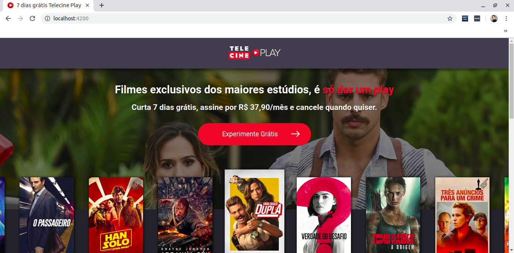

# Projeto Landing Page Assine Telecine - Manual de configuração

**Url do projeto: [telecine-app.herokuapp.com/](http://telecine-app.herokuapp.com/)**


Essa documentação destina-se à auxiliar no correto manuseio do projeto.

* [Instalando os componenents do projeto](#Tópico1)
* [Instalando os módulos e rodando o projeto](#Tópico2)
* [Rodando os testes](#Tópico3)
* [Gerando o build da aplicação](#Tópico4)
* [Rodando o gruntfile](#Tópico5)


## Instalando os componenents do projeto {#Tópico1}

Para rodar o projeto em sua máquina você precisará instalar os seguintes componentes em sequência:

**Nodejs**

Rode o comando à seguir para atualizar os pacotes do seu projeto.
```console
user@user-Machine-name:~$ sudo apt update
```

Rode o comando à seguir para instalar o node em sua máquina.
```console
user@user-Machine-name:~$ sudo apt install nodejs
```

**Angular Cli**

Agora que temos o node instalado, rode o comando à seguir para instalar o angular em sua máquina.
```console
user@user-Machine-name:~$ sudo npm install -g @angular/cli@8.1.0
```

## Instalando os módulos e rodando o projeto {#Tópico2}

Para instalar os módulos do seu projeto basta rodar o seguinte comando dentro da pasta d projeto:

```console
user@user-Machine-name:~/Documentos/Projetos/telecine-app$ sudo npm install
```

> Atenção, você precisa estar no root do projeto para que funcione corretamente.

Com isso podemos executar o seguinte comando para rodar o projeto em nossa máquina:

```console
user@user-Machine-name:~/Documentos/Projetos/telecine-app$ ng serve
```

1. Após rodar seu terminal ficará parecido com esse:


2. Abra o navegador e adicione o endereço que aparece no terminal. Por padrão o angular roda no endereço [http://localhost:4200/](http://localhost:4200/):


## Rodando os testes unitários {#Tópico3}

Para rodar nossos testes unitários você precisará ter o Google Chrome instalado. Caso ainda não tenha, siga os próximos passos, caso tenha, pule para a etapa seguinte a ele:

**Instalando o chrome**

Faça o download do arquivo `.deb` em seu computador. Recomendo fazer isso na pasta de `downloads`.
É só acessar o link [Google Chrome](https://dl.google.com/linux/direct/google-chrome-stable_current_amd64.deb)


Se preferir pode usar o comando `wget` para baixar:
```console
user@user-Machine-name:~/Downloads$ wget https://dl.google.com/linux/direct/google-chrome-stable_current_amd64.deb
```


> As vezes ocorre erro ao fazer pelo wget, por isso recomendo usar o navegador. 


Agora dentro da pasta em que você baixoy o arquivo rode o seguinte comando:
```console
user@user-Machine-name:~/Downloads$ sudo dpkg -i google-chrome-stable_current_amd64.deb
```


Pronto, agora seu Google Chrome está instalado.

**Rodando o teste**

Agora que temos o chrome instalado, rode o comando à seguir para executar seu teste no Google Chrome:

```console
user@user-Machine-name:~/Documentos/Projetos/telecine-app$ ng test --watch=true --browsers=Chrome
```

1. Seu terminal ficará parecido com o da imagem à seguir:


2. E seu navegador exibirá algo parecido com o da imagem à seguir:


O option `--watch=true` serve para manter o teste rodando constantemente e observando quando sua aplicação sofre qualquer alteração

Caso deseje que a janela do navegador não abra, execute o teste em modo oculto, através do seguinte comando:

```console
user@user-Machine-name:~/Documentos/Projetos/telecine-app$ ng test --watch=true --browsers=ChromeHeadless
```

Você também pode optar por deixar o `--watch=false` para que o teste unitário rode apenas uma vez e depois pare.

> Caso deseje saber a cobertura de código que seu teste está abrangendo use a opção `--codeCoverage=true` ao rodar o ng test.

## Gerando o build da aplicação {#Tópico4}

Para gerar o build da aplicação é muito simples. Siga os próximos passos para gerá-lo em desenvolvimento e produto: 

**Dev**

O comando à seguir serve para gerar um build do projeto em desenvolvimento, sem utilizar as otimizações que o angular possui para a versão de produção.
```console
user@user-Machine-name:~/Documentos/Projetos/telecine-app$ ng build
```

**Prod**

Aqui temos o comando que gera nosso build para produção, já com o código mais otimizado do que a versão em desenvolvimento. 

```console
user@user-Machine-name:~/Documentos/Projetos/telecine-app$ ng build --prod --aot --build-optimizer
```

Esses comandos irão compilar o projeto angular em um diretório chamado `dist`, dentro dele haverá uma pasta com o nome do projeto `telecine-app`, dentro desta pasta estarão todos os arquivos criados. Para mais dúvidas sobre o ng build consulte [Angular build](https://angular.io/cli/build)


## Rodando o gruntfile {#Tópico5}

O `gruntfile.js` foi um arquivo criado para automatizar nosso processo final. Ele assegurará que só faremos um build do projeto para produção se a aplicação for bem-sucedida em todos os testes unitários. 

Antes de rodar o grunt precisamos instalá-lo em nossa máquina. Rode o comando à seguir para isso:

```console
user@user-Machine-name:~/Documentos/Projetos/telecine-app$ sudo npm install -g grunt-cli
```

Agora que instalamos o grunt em nossa máquina de modo global, vamos rodar o nosso arquivo grunfile.js executando o comando à seguir:

```console
user@user-Machine-name:~/Documentos/Projetos/telecine-app$ grunt shell:build
```

Com isso o grunt realizará os testes e se todos ocorrerem corretamente ele realizará o build, assim como podemos ver no arquivo `gruntfile.js`. 


```javascript
module.exports = function(grunt){
    grunt.loadNpmTasks('grunt-shell')
    grunt.initConfig({
        shell: {
            build: {
                options: { stdout: true },
                command: [
                    'echo "=================== Realizando testes unitários ==================="',
                    'ng test --watch=false --browsers=ChromeHeadless',
                    'echo "=================== Gerando build da aplicação para produção ==================="',
                    'ng build --prod --aot --build-optimizer',
                    'echo "=================== Testes e builds finalizados com sucesso! ==================="',
                ].join('&&')
            }
        }
    });
 
    grunt.registerTask('default', ['shell:deploy']);
}
``` 

1. Após executar o `gruntfile.js` você verá seu terminal similar ao da imagem à seguir:


