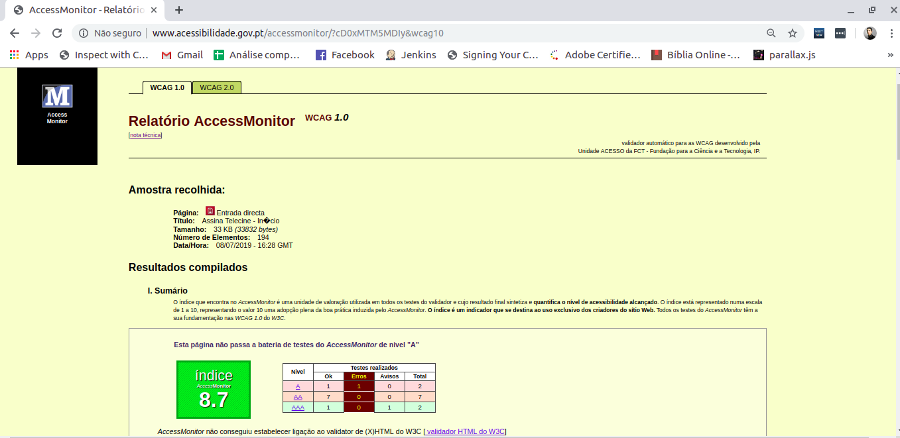
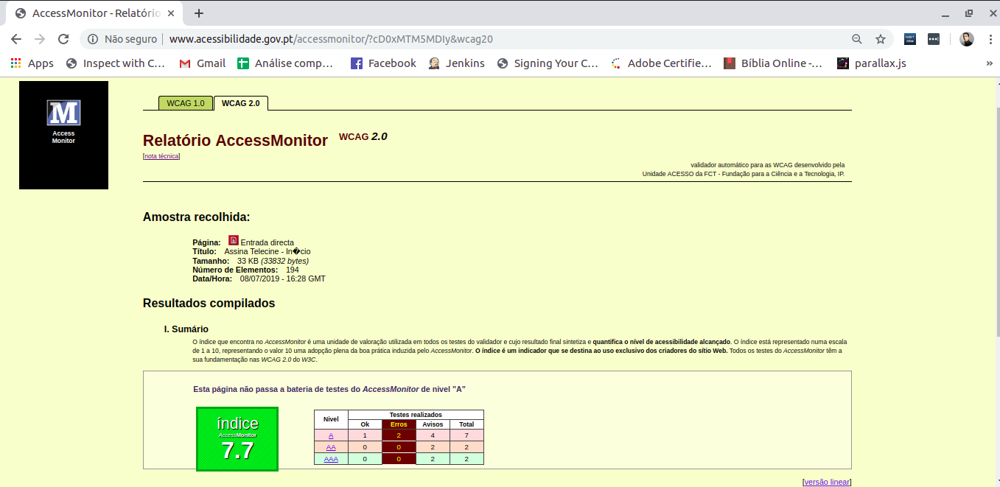
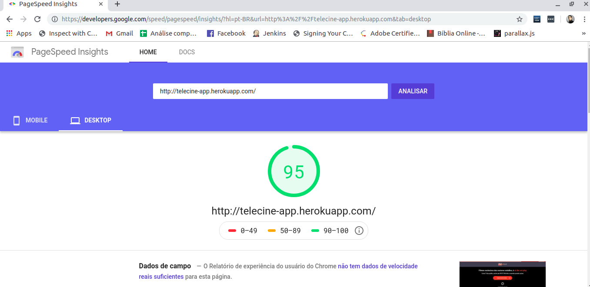
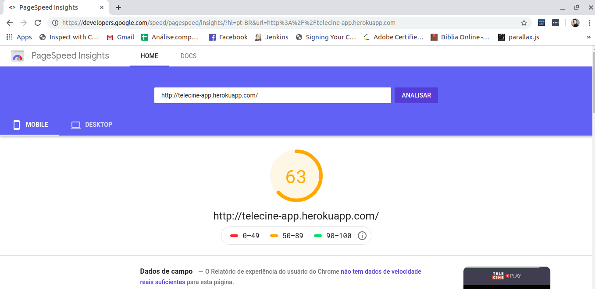

# Itens solicitados

## Acessibilidade

Segue print com análise de acessibilidade do site seguindo as diretrizes de `WCAG 1.0` e `WCAG 2.0`:

**[WCAG 1.0](http://www.acessibilidade.gov.pt/accessmonitor/)**

**[WCAG 2.0](http://www.acessibilidade.gov.pt/accessmonitor/)**

> Atenção: Para testar no site acessibilidade.gov.pt é necessário carregar a página, copiar o conteúdo dela pelo inspecionador de elementos e colar na aba Entrada Directa, pois a aplicação sendo uma SPA não carrega seu conteúdo no código fonte do navegador.

## Otimização

Análise feita no site [PageSpeed Insights](https://developers.google.com/speed/pagespeed/insights/?hl=pt-BR&url=http%3A%2F%2Ftelecine-app.herokuapp.com&tab=desktop)

